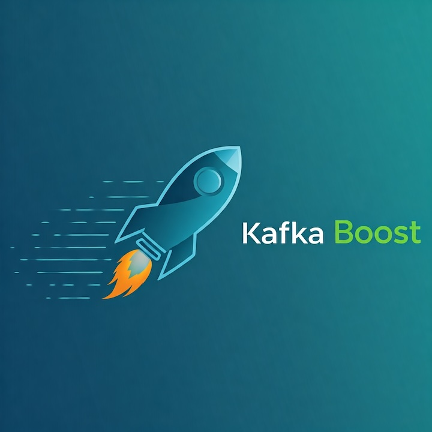

# KafkaBoost



## Overview

**KafkaBoost** is a cutting-edge solution designed to address the limitations of existing Kafka implementations. Our platform significantly reduces operating costs, optimizes network transfer, and enables limitless scaling for both brokers and consumers. Experience the power of infinite data retention and elastic scalability, all while maintaining high performance.

## Key Features

- **Reduce Operating Costs by 80%**  
  KafkaBoost optimizes resource usage, allowing you to achieve substantial savings on infrastructure and maintenance.

- **Lower Network Transfer Costs by 90%**  
  Our innovative compression and routing techniques minimize data transfer, significantly reducing your network expenses.

- **Infinite Scalability**  
  Scale out your Kafka brokers and consumers effortlessly. KafkaBoost ensures that you can handle increasing loads without the typical scaling limitations.

- **Infinite Data Retention**  
  Never worry about data loss. With KafkaBoost, store and retain all your data indefinitely, ensuring compliance and easy access.

- **Elastic Broker Scaling**  
  Automatically adjust the number of brokers based on demand, optimizing performance and resource allocation.

- **Infinitely Scalable Consumers**  
  Scale your consumer applications dynamically, ensuring seamless processing of data as your application grows.

## Getting Started

### Prerequisites

- Apache Kafka (version x.x or higher)
- [Docker](https://www.docker.com/) (for containerized deployment)
- [Java JDK](https://www.oracle.com/java/technologies/javase-jdk11-downloads.html) (version x.x or higher)

### Installation

1. Clone the repository:
   ```bash
   git clone https://github.com/KafkaBoost/KafkaBoost.git
   cd KafkaBoost

2. Build the project:
    ```bash
    Copy code
    ./gradlew build

3. Configure your Kafka environment in `config/kafka_config.yml`.

4. Deploy using Docker:
    ```bash
    Copy code
    docker-compose up -d

## Usage
Once deployed, KafkaBoost will automatically integrate with your existing Kafka setup. Monitor performance metrics via the provided dashboard to ensure optimal operation.

## Documentation

For detailed setup instructions, configuration options, and API usage, please refer to our documentation.

## Contributing

We welcome contributions from the community! To contribute:

1. Fork the repository.
2. Create a new branch:
    ```bash
    Copy code
    git checkout -b feature/YourFeature
3. Make your changes and commit them.
4. Push to your fork:
    ```bash
    Copy code
    git push origin feature/YourFeature
    Open a Pull Request.

## License

This project is licensed under the MIT License. See the LICENSE file for details.

## Support

For support and inquiries, please contact us at support@example.com.

Transform your Kafka experience with KafkaBoost. Say goodbye to limitations and hello to infinite possibilities!

Feel free to adjust any sections or details to better fit your software’s specifics!


